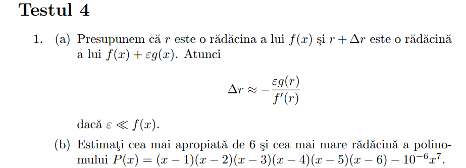

## Problema 1

$f(x) = (x-1)(x-2)(x-3)(x-4)(x-5)(x-6)$

$P(x) = f(x) - 10^{-6}x^7$

$\epsilon = -10^{-6}$

$g(x) = x^7$

$ε ≪ f (x)$

$$\Delta r \approx - \frac{\epsilon g(r)}{f'(r)}$$

Rezolvare:

$g(6) = 6^7 = 279936$

$f'(6) = (6-1)(6-2)(6-3)(6-4)(6-5) = 5 \cdot 4 \cdot 3 \cdot 2 \cdot 1 = 120$

$$\Delta r \approx - \frac{(-10^{-6}) \cdot 279936}{120} = \frac{0.279936}{120} = 0.0023328$$

=>
cea mai apropiata radacina de 6 va fi:

$radacina = 6 + \Delta r = 6 + 0.0023328 => radacina = 6.0023328$